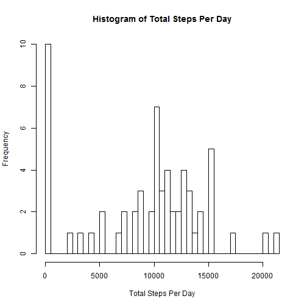
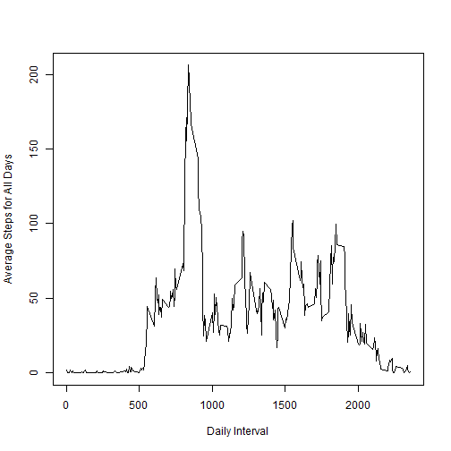
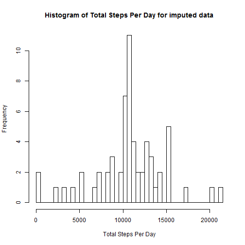
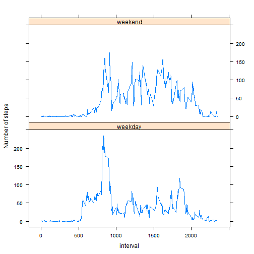

## Loading and preprocessing the data
- The format of raw data is **data.frame** , so there is no need for preprocessing


```r
rawData <-read.csv("D:/learning software and movies//COURSERA/Reproducible Research/Data For Assignments/activity.csv")
```
## What is mean total number of steps taken per day?
- First, aggregating the total number of steps per day

```r
totalStepsPerDay <- aggregate(rawData$steps, by=list(date=rawData$date),FUN=sum,na.rm=TRUE)
```

- After that, drawing the histogram

```r
hist(totalStepsPerDay$x, 
     breaks=nrow(totalStepsPerDay),
     main = paste("Histogram of Total Steps Per Day"),
     xlab = "Total Steps Per Day")
```

 

- Finally, calculating the mean and median

```r
meanTotal <- mean(totalStepsPerDay$x)
medianTotal <- median(totalStepsPerDay$x)
```
**mean**

```
## [1] 9354.23
```

**median**

```
## [1] 10395
```

## What is the average daily activity pattern?
- Finding the daily activity pattern for intervals and plotting the results

```r
dailyActivity <- aggregate(rawData$steps, by=list(interval=rawData$interval),FUN=mean,na.r=TRUE)
plot(dailyActivity$interval,dailyActivity$x,type="l",xlab = "Daily Interval",ylab = "Average Steps for All Days")
```

 

- Now, finding the the interval with maximum number of taken steps

```r
maxDailyInterval <- dailyActivity[which.max( dailyActivity$x ),1]
```
**The Interval**

```
## [1] 835
```
## Imputing missing values

- Calculate and report the total number of missing values in the dataset

```r
sum(is.na(rawData))
```

```
## [1] 2304
```

- Devise a strategy for filling in all of the missing values in the dataset.

      - **mean for that 5-minute interval**
      


```r
newData <- rawData
for (i in 1:nrow(newData))
{
      if (is.na(newData[i,1]))
      {
            temp <- dailyActivity[dailyActivity$interval == newData[i,3],]
            newData[i,1] = temp[1,2]
      }          
}
head(newData)
```

```
##       steps       date interval
## 1 1.7169811 2012-10-01        0
## 2 0.3396226 2012-10-01        5
## 3 0.1320755 2012-10-01       10
## 4 0.1509434 2012-10-01       15
## 5 0.0754717 2012-10-01       20
## 6 2.0943396 2012-10-01       25
```
- Histogram of new Data which has imputed missing values based on the mean of intervals


```r
newTotalStepsPerDay <- aggregate(newData$steps, by=list(date=newData$date),FUN=sum,na.rm=TRUE)

hist(newTotalStepsPerDay$x, 
     breaks=nrow(newTotalStepsPerDay),
     main = paste("Histogram of Total Steps Per Day for imputed data"),
     xlab = "Total Steps Per Day")
```

 
- Finally, calculating the mean and median of new imputed data

```r
newMeanTotal <- mean(newTotalStepsPerDay$x)
newMedianTotal <- median(newTotalStepsPerDay$x)
```
**New Mean**

```
## [1] 10766.19
```

**New Median**

```
## [1] 10766.19
```

- **As we can see, the mean and median are different from original data and mean = median**


## Are there differences in activity patterns between weekdays and weekends?
- Create a new factor variable in the dataset with two levels - "weekday" and "weekend"
      - **the dayType variable is add for this purpose**

```r
library(dplyr)
```

```
## Warning: package 'dplyr' was built under R version 3.1.3
```

```
## 
## Attaching package: 'dplyr'
## 
## The following object is masked from 'package:stats':
## 
##     filter
## 
## The following objects are masked from 'package:base':
## 
##     intersect, setdiff, setequal, union
```

```r
library(timeDate)
```

```
## Warning: package 'timeDate' was built under R version 3.1.3
```

```r
rawData2 <- mutate(rawData, dayType = ifelse(isWeekday(as.Date(date)) == TRUE,'weekday','weekend'))
head(rawData2)
```

```
##   steps       date interval dayType
## 1    NA 2012-10-01        0 weekday
## 2    NA 2012-10-01        5 weekday
## 3    NA 2012-10-01       10 weekday
## 4    NA 2012-10-01       15 weekday
## 5    NA 2012-10-01       20 weekday
## 6    NA 2012-10-01       25 weekday
```
- Finally, plotting the data based on weekend and weekday

```r
library(lattice)
newDailyActivity <- aggregate(rawData2$steps, by=list(interval=rawData2$interval,dayType = rawData2$dayType),FUN=mean,na.r=TRUE)
xyplot(x ~ interval | dayType, data = newDailyActivity, layout = c(1, 2),type = "l",
       ylab = "Number of steps")
```

 
